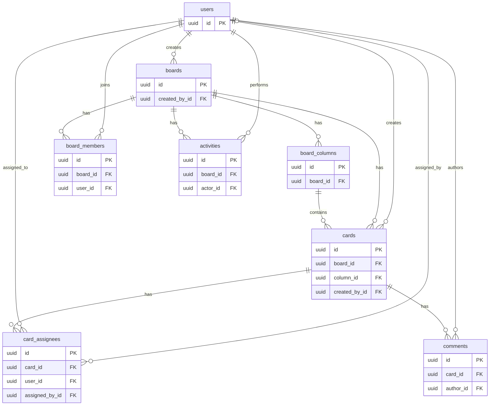

# Database Design — Realtime Collaborative Kanban MVP

## Tổng quan

Tài liệu này chốt schema và các ràng buộc dữ liệu cho MVP, làm cơ sở cho task triển khai TypeORM entities và migration đầu tiên. PostgreSQL lưu persistent business state; TypeORM dùng migrations với `synchronize: false`. Thiết kế chỉ gồm tám bảng: `users`, `boards`, `board_members`, `board_columns`, `cards`, `card_assignees`, `comments` và `activities`.

Mọi bảng dùng UUID primary key. Tên bảng/cột trong database dùng `snake_case`, property TypeScript dùng `camelCase`. Các timestamp dùng PostgreSQL `timestamptz` và lưu theo UTC.

## ER Diagram

Diagram chỉ hiển thị khóa và quan hệ; các cột còn lại nằm trong bảng chi tiết bên dưới. `assigned_by_id` là FK nullable; các FK khác trong diagram là bắt buộc.

## Chi tiết bảng

Trong các bảng dưới đây, `Không` ở cột Nullable nghĩa là `NOT NULL`. `created_at` và `updated_at` đều là timestamp persistent; không mặc định thêm field khác ngoài danh sách.

### `users`

| Cột             | PostgreSQL type | Nullable | Ràng buộc / ý nghĩa                                   |
| --------------- | --------------- | -------- | ----------------------------------------------------- |
| `id`            | `uuid`          | Không    | Primary key.                                          |
| `email`         | `varchar`       | Không    | Unique; định danh đăng nhập.                          |
| `password_hash` | `varchar`       | Không    | Chỉ lưu password hash, không lưu plain-text password. |
| `display_name`  | `varchar`       | Không    | Tên hiển thị.                                         |
| `avatar_url`    | `varchar`       | Có       | URL ảnh đại diện nếu có.                              |
| `created_at`    | `timestamptz`   | Không    | Thời điểm tạo.                                        |
| `updated_at`    | `timestamptz`   | Không    | Thời điểm cập nhật.                                   |

### `boards`

| Cột             | PostgreSQL type | Nullable | Ràng buộc / ý nghĩa         |
| --------------- | --------------- | -------- | --------------------------- |
| `id`            | `uuid`          | Không    | Primary key.                |
| `name`          | `varchar`       | Không    | Tên board.                  |
| `description`   | `text`          | Có       | Mô tả board.                |
| `created_by_id` | `uuid`          | Không    | FK → `users.id`; người tạo. |
| `is_archived`   | `boolean`       | Không    | Mặc định `false`.           |
| `archived_at`   | `timestamptz`   | Có       | Thời điểm archive.          |
| `created_at`    | `timestamptz`   | Không    | Thời điểm tạo.              |
| `updated_at`    | `timestamptz`   | Không    | Thời điểm cập nhật.         |

Khi tạo `Board`, tạo cả `BoardMember` cho người tạo với role `OWNER`. Các bước persistence này phải nhất quán, dự kiến trong cùng transaction. Normal user flow dùng archive; hard delete không phải operation mặc định của MVP.

### `board_members`

| Cột          | PostgreSQL type | Nullable | Ràng buộc / ý nghĩa        |
| ------------ | --------------- | -------- | -------------------------- |
| `id`         | `uuid`          | Không    | Primary key.               |
| `board_id`   | `uuid`          | Không    | FK → `boards.id`.          |
| `user_id`    | `uuid`          | Không    | FK → `users.id`.           |
| `role`       | `enum`          | Không    | Chỉ `OWNER` hoặc `MEMBER`. |
| `joined_at`  | `timestamptz`   | Không    | Thời điểm tham gia board.  |
| `created_at` | `timestamptz`   | Không    | Thời điểm tạo record.      |
| `updated_at` | `timestamptz`   | Không    | Thời điểm cập nhật record. |

`UNIQUE(board_id, user_id)` ngăn membership trùng. `board_members` là nguồn dữ liệu chính để backend xác thực board-level authorization.

### `board_columns`

| Cột          | PostgreSQL type  | Nullable | Ràng buộc / ý nghĩa        |
| ------------ | ---------------- | -------- | -------------------------- |
| `id`         | `uuid`           | Không    | Primary key.               |
| `board_id`   | `uuid`           | Không    | FK → `boards.id`.          |
| `name`       | `varchar`        | Không    | Tên column.                |
| `position`   | `numeric(20,10)` | Không    | Thứ tự column trong board. |
| `created_at` | `timestamptz`    | Không    | Thời điểm tạo.             |
| `updated_at` | `timestamptz`    | Không    | Thời điểm cập nhật.        |

### `cards`

| Cột             | PostgreSQL type  | Nullable | Ràng buộc / ý nghĩa                       |
| --------------- | ---------------- | -------- | ----------------------------------------- |
| `id`            | `uuid`           | Không    | Primary key.                              |
| `board_id`      | `uuid`           | Không    | FK → `boards.id`.                         |
| `column_id`     | `uuid`           | Không    | FK → `board_columns.id`; column hiện tại. |
| `created_by_id` | `uuid`           | Không    | FK → `users.id`; người tạo.               |
| `title`         | `varchar`        | Không    | Tiêu đề.                                  |
| `description`   | `text`           | Có       | Mô tả.                                    |
| `position`      | `numeric(20,10)` | Không    | Thứ tự trong column.                      |
| `due_date`      | `timestamptz`    | Có       | Deadline.                                 |
| `is_archived`   | `boolean`        | Không    | Mặc định `false`.                         |
| `archived_at`   | `timestamptz`    | Có       | Thời điểm archive.                        |
| `created_at`    | `timestamptz`    | Không    | Thời điểm tạo.                            |
| `updated_at`    | `timestamptz`    | Không    | Thời điểm cập nhật.                       |

Giữ `board_id` trực tiếp trên `Card` để query card theo board, kiểm tra quyền và route realtime event đơn giản hơn, đồng thời tránh join qua column ở một số query. Mỗi khi gán column cho card — lúc tạo card, move card hoặc bất kỳ operation nào đổi `column_id` — backend phải validate column thuộc cùng board với `cards.board_id` và giữ bất biến `card.board_id == column.board_id`. MVP không có field `status`; column hiện tại là state/status của card. Normal user flow dùng archive.

### `card_assignees`

| Cột              | PostgreSQL type | Nullable | Ràng buộc / ý nghĩa                   |
| ---------------- | --------------- | -------- | ------------------------------------- |
| `id`             | `uuid`          | Không    | Primary key.                          |
| `card_id`        | `uuid`          | Không    | FK → `cards.id`.                      |
| `user_id`        | `uuid`          | Không    | FK → `users.id`; assignee.            |
| `assigned_by_id` | `uuid`          | Có       | FK → `users.id`; người assign nếu có. |
| `created_at`     | `timestamptz`   | Không    | Thời điểm assign.                     |

`UNIQUE(card_id, user_id)` ngăn assign trùng. Một card có thể có nhiều assignee; user được assign phải là `BoardMember` của board chứa card.

### `comments`

| Cột          | PostgreSQL type | Nullable | Ràng buộc / ý nghĩa                   |
| ------------ | --------------- | -------- | ------------------------------------- |
| `id`         | `uuid`          | Không    | Primary key.                          |
| `card_id`    | `uuid`          | Không    | FK → `cards.id`.                      |
| `author_id`  | `uuid`          | Không    | FK → `users.id`; tác giả.             |
| `content`    | `text`          | Không    | Nội dung comment.                     |
| `created_at` | `timestamptz`   | Không    | Thời điểm tạo.                        |
| `updated_at` | `timestamptz`   | Không    | Thời điểm cập nhật.                   |
| `deleted_at` | `timestamptz`   | Có       | Soft delete; `NULL` khi còn hiệu lực. |

### `activities`

| Cột           | PostgreSQL type | Nullable | Ràng buộc / ý nghĩa                                      |
| ------------- | --------------- | -------- | -------------------------------------------------------- |
| `id`          | `uuid`          | Không    | Primary key.                                             |
| `board_id`    | `uuid`          | Không    | FK → `boards.id`.                                        |
| `actor_id`    | `uuid`          | Không    | FK → `users.id`; người thực hiện.                        |
| `action_type` | `enum`          | Không    | Loại business action.                                    |
| `entity_type` | `enum`          | Không    | Loại entity liên quan.                                   |
| `entity_id`   | `uuid`          | Có       | ID entity liên quan; không phải FK tới một bảng cố định. |
| `metadata`    | `jsonb`         | Có       | Structured context để render activity.                   |
| `created_at`  | `timestamptz`   | Không    | Thời điểm xảy ra action.                                 |

`Activity` lưu audit data có cấu trúc, không chỉ một chuỗi văn bản đã render. Backend tạo activity sau khi business action thành công. Các giá trị enum dự kiến:

| `action_type`                                                        | `entity_type` |
| -------------------------------------------------------------------- | ------------- |
| `BOARD_UPDATED`                                                      | `BOARD`       |
| `MEMBER_ADDED`, `MEMBER_REMOVED`, `ROLE_CHANGED`                     | `MEMBER`      |
| `COLUMN_CREATED`, `COLUMN_UPDATED`, `COLUMN_MOVED`, `COLUMN_DELETED` | `COLUMN`      |
| `CARD_CREATED`, `CARD_UPDATED`, `CARD_MOVED`, `CARD_ARCHIVED`        | `CARD`        |
| `COMMENT_CREATED`, `COMMENT_UPDATED`, `COMMENT_DELETED`              | `COMMENT`     |

Danh sách này chỉ gồm các giá trị thuộc scope hiện tại; có thể refine ở task implementation nếu business rule yêu cầu.

## Delete / Archive Strategy

- `Board`: archive trong normal flow; hard delete không phải thao tác mặc định của MVP.
- `Card`: archive trong normal flow; hard delete không phải thao tác mặc định của MVP.
- `Comment`: soft delete bằng `deleted_at`; normal flow không xóa vật lý ngay.
- `Column`: không hard delete nếu còn **bất kỳ card nào** tham chiếu, kể cả active và archived card; backend trả HTTP `409 Conflict`. Muốn hard delete column, phải move tất cả card đang tham chiếu sang column khác trước. Archive card một mình không xóa `column_id` và không làm cho column có thể bị hard delete.

## FK / Cascade Strategy

| FK                       | Hướng `ON DELETE` | Lý do                                               |
| ------------------------ | ----------------- | --------------------------------------------------- |
| `board_members.board_id` | `CASCADE`         | Membership phụ thuộc board.                         |
| `board_columns.board_id` | `CASCADE`         | Column thuộc board.                                 |
| `cards.board_id`         | `CASCADE`         | Card thuộc board.                                   |
| `cards.column_id`        | `RESTRICT`        | Chặn xóa column khi bất kỳ card nào còn tham chiếu. |
| `card_assignees.card_id` | `CASCADE`         | Assignment phụ thuộc card.                          |
| `comments.card_id`       | `CASCADE`         | Comment phụ thuộc card.                             |

Các rule trên là hướng cho trường hợp hard delete hiếm gặp; archive board/card không kích hoạt cascade. Chỉ các FK được liệt kê ở trên mới có planned `CASCADE`/`RESTRICT` behavior này. Các FK khác không được cascade tự động khi chưa có business rule; implementation nên giữ behavior an toàn mặc định (`NO ACTION`/`RESTRICT` theo mapping phù hợp của PostgreSQL/TypeORM) cho đến khi requirement được chốt. Khi cần hard delete board, phải xử lý card trước column vì `cards.column_id RESTRICT`; không thể giả định các cascade từ `boards` tự giải quyết toàn bộ đồ thị quan hệ.

## Constraint và Index Strategy

| Constraint / index                        | Query pattern hoặc lý do                               |
| ----------------------------------------- | ------------------------------------------------------ |
| `users.email UNIQUE`                      | Đảm bảo email duy nhất; hỗ trợ tìm user khi đăng nhập. |
| `board_members(board_id, user_id) UNIQUE` | Kiểm tra membership và liệt kê member của board.       |
| `card_assignees(card_id, user_id) UNIQUE` | Chặn assign trùng và liệt kê assignee của card.        |
| `board_columns(board_id, position)`       | Tải column của board theo thứ tự.                      |
| `cards(board_id)`                         | Tải card theo board.                                   |
| `cards(column_id)`                        | Tải/kiểm tra card thuộc column.                        |
| `cards(board_id, column_id)`              | Lọc card trong một column của board.                   |
| `comments(card_id)`                       | Tải comment theo card.                                 |
| `activities(board_id, created_at)`        | Tải lịch sử board theo thời gian.                      |

`board_members.user_id` có query pattern khi liệt kê board của user, nên cần xem xét index riêng. Không cần tự động thêm `board_columns(board_id)` vì đã được cover bởi tiền tố của `(board_id, position)`. Tương tự, `cards(board_id)` có thể redundant nếu `(board_id, column_id)` đáp ứng các query thực tế; task implementation cần kiểm tra query plan trước khi giữ cả hai. Composite index không thay thế `cards(column_id)` cho truy vấn chỉ lọc `column_id`.

## Position Strategy

`board_columns.position` và `cards.position` dùng `NUMERIC(20,10)` để hỗ trợ fractional ordering. Ví dụ các position `100`, `200`, `300`: chèn giữa `100` và `200` dùng `150` thay vì cập nhật toàn bộ record phía sau. Khi khoảng cách giữa các position quá nhỏ, có thể cần rebalance; task này chưa triển khai thuật toán đó.

## Source of Truth và Realtime Consistency

PostgreSQL là source of truth cho persistent business state. Socket.IO event và presence không thay thế dữ liệu lưu bền. Backend chỉ broadcast event sau khi business operation và persistence thành công; operation cần transaction thì broadcast sau khi transaction thành công.

## Naming Convention

| Database (`snake_case`) | TypeScript (`camelCase`) |
| ----------------------- | ------------------------ |
| `created_by_id`         | `createdById`            |
| `display_name`          | `displayName`            |

Timestamp persistent dùng `timestamptz` và lưu theo UTC; việc hiển thị múi giờ thuộc phía client.

## Ngoài phạm vi database MVP

Chưa có workspace, labels, attachments, checklist, card priority, notification system, invitation token system, calendar, time tracking, analytics, automation rules hoặc CRDT state. Nếu sau này có requirement, bổ sung bằng migration mới.
