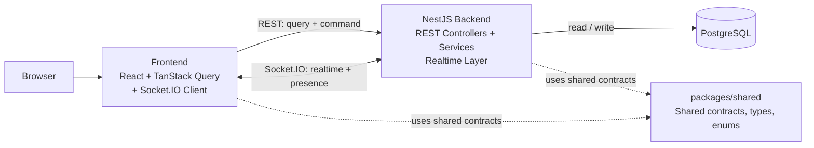

# System Architecture

## 1. Tổng quan hệ thống

Realtime Collaborative Kanban là ứng dụng Kanban cho phép nhiều người cùng làm việc trên một `Board`. Thành viên có thể quản lý `Column` và `Card`, trao đổi qua `Comment`, theo dõi `Activity` và nhận các thay đổi quan trọng theo thời gian thực mà không cần tải lại trang.

Kiến trúc MVP là một modular monolith với PostgreSQL làm nơi lưu trữ persistent business state. Frontend chạy trong trình duyệt, backend cung cấp REST API và realtime layer, còn `packages/shared` chứa các contract hoặc kiểu dữ liệu thực sự dùng chung giữa frontend và backend.

Tài liệu này mô tả architecture mục tiêu của MVP và đồng thời ghi rõ trạng thái triển khai hiện tại. Repository hiện vẫn ở giai đoạn Foundation / architecture preparation: frontend và backend mới là skeleton, chưa có business module, entity, migration, authentication hoặc realtime business logic.

## 2. High-level component architecture



### Frontend

Frontend là ứng dụng React chạy local trong trình duyệt. Frontend chịu trách nhiệm:

- render board, column, card, comment và các trạng thái giao diện;
- nhận thao tác của user và gửi query hoặc business command qua REST;
- quản lý server state và cache bằng TanStack Query;
- sử dụng Socket.IO Client để nhận realtime updates, presence và collaboration events;
- cập nhật hoặc invalidate cache sau khi nhận response REST hoặc realtime event.

Frontend không phải source of truth cho persistent business state. Optimistic UI, nếu được dùng sau này, chỉ là cơ chế phản hồi giao diện tạm thời; kết quả cuối cùng phải do backend xác nhận.

### Backend

Backend là NestJS modular monolith. Backend chịu trách nhiệm:

- authentication và kiểm tra authorization ở server;
- nhận REST query và command qua controller;
- thực hiện business logic trong service hoặc business module tương ứng;
- đọc và ghi persistent state qua TypeORM và PostgreSQL;
- tạo `Activity` cho các business action phù hợp;
- điều phối realtime layer sau khi business operation đã persist thành công.

Các business module dự kiến gồm `auth`, `users`, `boards`, `board-members`, `columns`, `cards`, `comments` và `activities`. `realtime` là cross-cutting layer, không phải business domain module và không chứa core business logic.

### PostgreSQL

PostgreSQL lưu persistent business state của hệ thống, gồm các domain concept như `User`, `Board`, `BoardMember`, `Column`, `Card`, `CardAssignee`, `Comment` và `Activity`.

Backend là nơi truy cập database và là authority cho các thay đổi nghiệp vụ. TypeORM dùng migrations; `synchronize` được giữ ở trạng thái `false` để schema không bị thay đổi ngầm theo entity.

### `packages/shared`

`packages/shared` chỉ chứa những thành phần thực sự dùng chung giữa frontend và backend, chẳng hạn shared types, contracts, enums và realtime event names.

Package này không chứa TypeORM entities, repositories, services hoặc code chỉ thuộc backend. Ở trạng thái hiện tại, package mới có phần export nền tảng; các shared contract sẽ được bổ sung cùng những feature cần dùng chung.

### Realtime layer

Realtime layer sử dụng Socket.IO cho:

- broadcast business changes đến các client đang xem cùng board;
- presence và collaboration events;
- quản lý board room theo convention `board:{boardId}`.

Client chỉ được join hoặc listen board room sau khi backend xác nhận user có quyền truy cập board. Realtime layer không thay thế REST, database transaction hoặc authorization ở backend.

## 3. REST request flow

REST được dùng cho initial data loading, query và command/business operation.

```text
User action
    → Frontend
    → REST request
    → Controller
    → Service / business module
    → validate authentication, authorization và business rules
    → TypeORM repository
    → PostgreSQL
    → HTTP response
    → Frontend cập nhật hoặc invalidate cache
```

Ví dụ, khi user di chuyển một `Card`, frontend gửi command đến backend. Backend kiểm tra user có quyền trên `Board`, kiểm tra `Column` đích thuộc đúng board và kiểm tra các business rule khác. Chỉ khi database persist thành công, backend mới trả kết quả thành công và phát realtime event cho các client liên quan.

## 4. Realtime flow

Realtime event được phát sinh từ một business operation đã được xử lý bởi backend, không phải từ một thay đổi chỉ tồn tại ở client.

```text
User action
    → Frontend gửi command qua REST
    → Backend xác thực và kiểm tra authorization
    → Service xử lý business rules
    → PostgreSQL persist thành công
    → Realtime layer broadcast event vào board:{boardId}
    → Các client trong board room nhận event
    → Frontend cập nhật hoặc invalidate cache
    → UI hiển thị state mới
```

Nguyên tắc bắt buộc là persistence before broadcast: backend chỉ broadcast sau khi business operation và transaction cần thiết đã thành công. Socket.IO event chỉ là thông báo để đồng bộ giao diện; PostgreSQL vẫn là source of truth cho persistent business state. Nếu client bị mất event, client có thể dùng REST để tải lại state từ backend.

Presence là trạng thái realtime tạm thời, không phải persistent business data. Presence vẫn phải tuân thủ authentication và board-level authorization.

## 5. Authentication và authorization boundary

- Protected API yêu cầu user đã được authentication.
- Backend luôn enforce authorization; frontend không được tự quyết định quyền truy cập cuối cùng.
- Quyền truy cập board dựa trên `BoardMember`.
- MVP có hai role: `OWNER` và `MEMBER`.
- User không phải thành viên của board không được truy cập dữ liệu hoặc realtime room của board đó.
- Backend phải xác nhận quyền trước khi client join hoặc listen room `board:{boardId}`.

Chi tiết cơ chế JWT hoặc session không thuộc phạm vi của tài liệu high-level này. Dù cơ chế authentication cụ thể là gì, mọi protected REST request và socket connection có yêu cầu quyền đều phải được backend kiểm tra.

## 6. Development runtime hiện tại

Môi trường development hiện tại gồm:

- **Frontend:** chạy local bằng Vite, mặc định tại `http://localhost:5173`.
- **Backend:** chạy local bằng NestJS, mặc định tại `http://localhost:3000`.
- **PostgreSQL:** chạy trong Docker container và được backend truy cập qua published host port.

Repository hiện đã có cấu hình TypeORM cho PostgreSQL, đường dẫn entities và migrations, đồng thời tắt schema synchronization. Tuy nhiên, source hiện tại mới có health endpoint; chưa có entity, migration, authentication, business module hoặc realtime gateway được triển khai.

Tài liệu này không mô tả deployment architecture production vì project chưa ở giai đoạn đó.

## 7. Architectural principles

### Server authoritative

Backend quyết định kết quả cuối cùng của business operation. Frontend không tự trở thành authority cho persistent state.

### Database as source of truth

PostgreSQL là source of truth cho state lưu bền. Cache frontend và realtime event chỉ hỗ trợ hiển thị, truyền tải và đồng bộ state.

### REST + WebSocket hybrid

REST phục vụ initial fetch, query và command. Socket.IO phục vụ realtime updates, presence và collaboration events. Hệ thống không được thiết kế theo hướng socket-only.

### Persistence before broadcast

Business change phải được validate và persist thành công trước khi realtime event được broadcast. Event không thay thế database transaction.

### Modular monolith

MVP được tổ chức thành các module trong một backend NestJS. Core business logic nằm trong module/service, không nằm trong Socket.IO gateway.

### Tránh premature infrastructure

Chỉ thêm infrastructure mới khi có requirement và workload phù hợp. MVP ưu tiên kiến trúc đơn giản, có thể kiểm chứng và phù hợp với quy mô hiện tại.

## 8. Ngoài phạm vi kiến trúc MVP

Các thành phần sau không thuộc current architecture của MVP:

- Redis;
- Kafka;
- microservices;
- CQRS;
- CRDT;
- offline-first architecture.

Đây không phải các dependency cần thêm để hoàn thành MVP. Chúng chỉ có thể được xem xét lại khi xuất hiện requirement rõ ràng và có đánh giá phù hợp.

## 9. Future evolution

Các hướng dưới đây là future consideration, không phải một phần của architecture hiện tại:

- **Redis Socket.IO adapter:** có thể xem xét khi backend chạy nhiều instance và cần chia sẻ realtime room giữa các instance.
- **Object storage:** có thể xem xét nếu sản phẩm bổ sung file attachment hoặc media upload.
- **Queue / background job:** có thể xem xét khi xuất hiện workload dài, bất đồng bộ hoặc cần retry độc lập với request lifecycle.

Mỗi hướng mở rộng cần được chốt bằng requirement riêng, đánh giá về consistency, vận hành và chi phí trước khi triển khai.

## 10. Trạng thái source và assumption

Tài liệu này phân biệt hai trạng thái:

1. **Current implementation:** repository đang ở giai đoạn skeleton. Frontend, backend, PostgreSQL development environment, shared package và tooling đã được chuẩn bị; business feature chưa được implement.
2. **MVP architecture target:** các flow REST, Socket.IO, authorization, persistence before broadcast và các business module được mô tả là hướng kiến trúc đã thống nhất cho những task implement tiếp theo.

Không có redesign hoặc technology stack mới nào được đưa vào tài liệu. Những thành phần chưa xuất hiện trong source hiện tại được ghi rõ là planned hoặc target architecture thay vì mô tả như feature đã hoàn thành.
